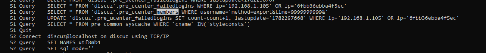
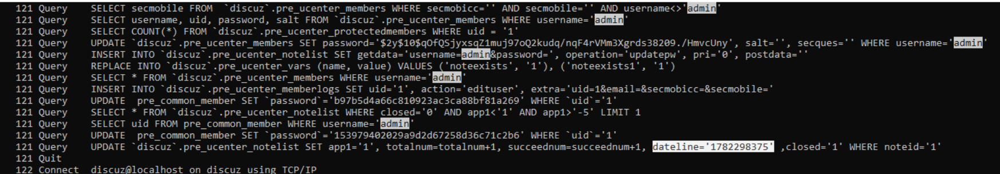

# Questions - Forum Breach
## Question 1
While reviewing the forum server's logs, you notice traffic that doesn't match normal user behavior. What is the exact timestamp of the attacker's first attempt to exploit the forum application? (4 points)  
`YYYY-MM-DD HH:MM:SS`

```
cd /mnt/c/Users/BTLOTest/Desktop/Artefacts/ForumBreach/uac-linux-20260625114019/[

grep 200 var/log/nginx/access.log.1  | less

grep -v -E "\.(css|js|png|jpg|jpeg|gif|ico|woff|woff2|svg|txt)" access.log.1

grep "\.php" var/log/nginx/access.log.1 | grep -v -E "\.(css|js)"

awk '{print $1}' var/log/nginx/access.log.1  | sort | uniq -c | sort -nr

grep -E "^192.168.9.1 " var/log/nginx/access.log.1  | grep -v -E "\.(css|png|jpg|gif)" | cut -f2 -d'"' | uniq -c

**ANSWER**
[root]$ grep -vE "\.(css|js|png|gif|jpg|jpeg|ico|svg)(\ ?.* )? HTTP" var/log/nginx/access.log.1 | grep -v "Mozilla/5.0"
127.0.0.1 - - [23/Jun/2026:11:09:14 +0300] "HEAD / HTTP/1.1" 404 @ "-" "curl/7.81.0"
127.0.0.1 - - [23/Jun/2026:11:09:24 +0300] "HEAD /install/ HTTP/1.1" 404 0 "-" "curl/7.81.0" 
127.0.0.1 - - [23/Jun/2026:11:13:38 +0300] "HEAD / HTTP/1.1" 302 0 "-" "curl/7.81.0"
192.168.9.1 - - [23/Jun/2026:12:43:20 +0300] "POST /member.php?mod=logging&action=login&loginsubmit=yes HTTP/1.1" 200 4184 "-" "python-requests/2.34.2"
```


`2026-06-23 09:43:20`


---

## Question 2
Your analysis shows the attacker was able to export the application's database without ever authenticating. Which PHP file was abused to make this possible? (4 points)  
`file.php`

`db.bak.php`

---

## Question 3
The attacker exploited a race condition by registering a "special" username with the administrator's password hash coming from the exported database. What was the exact username used for this registration as recorded in the database logs? (4 points)  
`XXXXXXXXXXXXXXXXXXXXXXXXXXXXXXXX X XXXXXXXX`

` /[root]$ less var/log/mysql/mysql.log `



` 57 Query    INSERT INTO `discuz`.pre_ucenter_members SET  secques='', username='c9a9cd672e8d2c7127f571acf6e7ddc3    1       17f3f58e', password='$2y$10$4YCoB6yiUHD6uLpzuTqm/O1qS70JAJuH3nyPI1ZiNC0EH/pBczwP.', email='f1fe2526d01ae279@qq.com', regip='192.168.1.105', regdate='1782297671', salt=''  `

---

## Question 4
Having gained administrative session cookies through the race condition, the attacker proceeded to reset the administrator's password. At what exact time did this password reset take place? (4 points)  
`YYYY-MM-DD HH:MM:SS`

less var/log/mysql/mysql.log 
```
SELECT username, uid, password, salt FROM discuz` .pre_ucenter_members WHERE username='admin'
SELECT COUNT(*) FROM discuz` .pre_ucenter_protectedmembers WHERE uid = '1
UPDATE discuz` .pre_ucenter_members SET password='$2y$10$q0fQSjyxsqZ1muj97oQ2kudq/nqF4rVMm3Xgrds38209./HmvcUny', salt='', secques='' WHERE username='admin
INSERT INTO discuz` .pre_ucenter_notelist SET getdata='username=admin&password=', operation='updatepw', pri='0', postdata=''
REPLACE INTO discuz` .pre_ucenter_vars (name, value) VALUES ('noteexists', '1'), ('noteexists1', '1')
SELECT * FROM discuz` .pre_ucenter_members WHERE username='admin
INSERT INTO discuz' .pre_ucenter_memberlogs SET uid='1', action='edituser', extra='uid=1&email=&secmobicc=&secmobile='
UPDATE pre_common_member SET password='b97b5d4a66c810923ac3ca88bf81a269' WHERE uid='1'
SELECT * FROM discuz` .pre_ucenter_notelist WHERE closed='0' AND app1<'1' AND app1>'-5' LIMIT 1
SELECT uid FROM pre_common_member WHERE username='admin
UPDATE pre_common_member SET password='153979402029a9d2d67258d36c71c2b6' WHERE uid='1'
UPDATE discuz`.pre_ucenter_notelist SET app1='1', totalnum=totalnum+1, succeednum=succeednum+1, dateline='1782298375' ,closed='1' WHERE noteid='1'
discuz@localhost on discuz using TCP/IP
```
/var/www/html/discuz/data/attachment/common/cf/220525ib33aahzvoqkmpkk.png
1.
/var/www/discuz5/data/attachment/common/cf/220525ib33aahzvoqkmpkk.png
2.
/var/www/discuz/data/attachment/common/cf/220525ib33aahzvoqkmpkk.png
3.

/var/www/html/discuz/data/attachment/common/cf/220525ib33aahzvoqkmpkk.png (The
most common default Nginx mapping for Discuz).

/var/www/html/data/attachment/common/cf/220525ib33aahzvoqkmpkk.png (If the forum
was installed directly in the web root).

/var/www/discuz/data/attachment/common/cf/220525ib33aahzvoqkmpkk.png (Double-
check for any typos, double slashes, or spacing issues in your submission).




epoch timestamp 1782298375, we get in UTC: 2026-06-24 10:52:55


---

## Question 5
As part of establishing a foothold, the attacker uploaded a PHP stager disguised as a legitimate file belonging to the forum. What is the full path on the filesystem where this first "stager" was stored? (4 points)  
`/var/…/full/path/to/file.ext`

`var/www/discuz/data/attachment/common/cf/185430phbhbnruhnuan6hg.png`


---

## Question 6
To trigger the RCE, the attacker imported a malicious plugin. What was the pluginid assigned by the system to this first malicious plugin? (3 points)  
`integer`

---

## Question 7
As a result the malicious plugin enabled, triggering the stager to drop its webshell. At what exact time did the attacker first access the webshell successfully? (4 points)  
`YYYY-MM-DD HH:MM:SS`

---

## Question 8
Once the plugin was enabled, a persistent webshell appeared on the filesystem. What is the full path of this webshell file? (4 points)  
`/var/…/full/path/to/webshell.php`

---

## Question 9
From the webshell, the attacker wanted a more interactive session. What is the exact command they executed to upgrade their shell? (3 points)  
`Full Command Line`

---

## Question 10
At some point the attacker escalated their privileges on the host. At what exact time did this privilege escalation occur? (4 points)  
`YYYY-MM-DD HH:MM:SS`

---

## Question 11
With root-level access, the attacker used a specific utility to dump the entire database. At what exact time did this dump take place? (4 points)  
`YYYY-MM-DD HH:MM:SS`

---

## Question 12
Shortly after, the attacker exfiltrated the dump from the server. At what exact time did the exfiltration occur? (4 points)  
`YYYY-MM-DD HH:MM:SS`

---

## Question 13
Before leaving the system, the attacker dropped a text file in the root directory. What is the name of this file? (4 points)  
`file.ext`

---


# Indicators of Compromise (IOCs)
